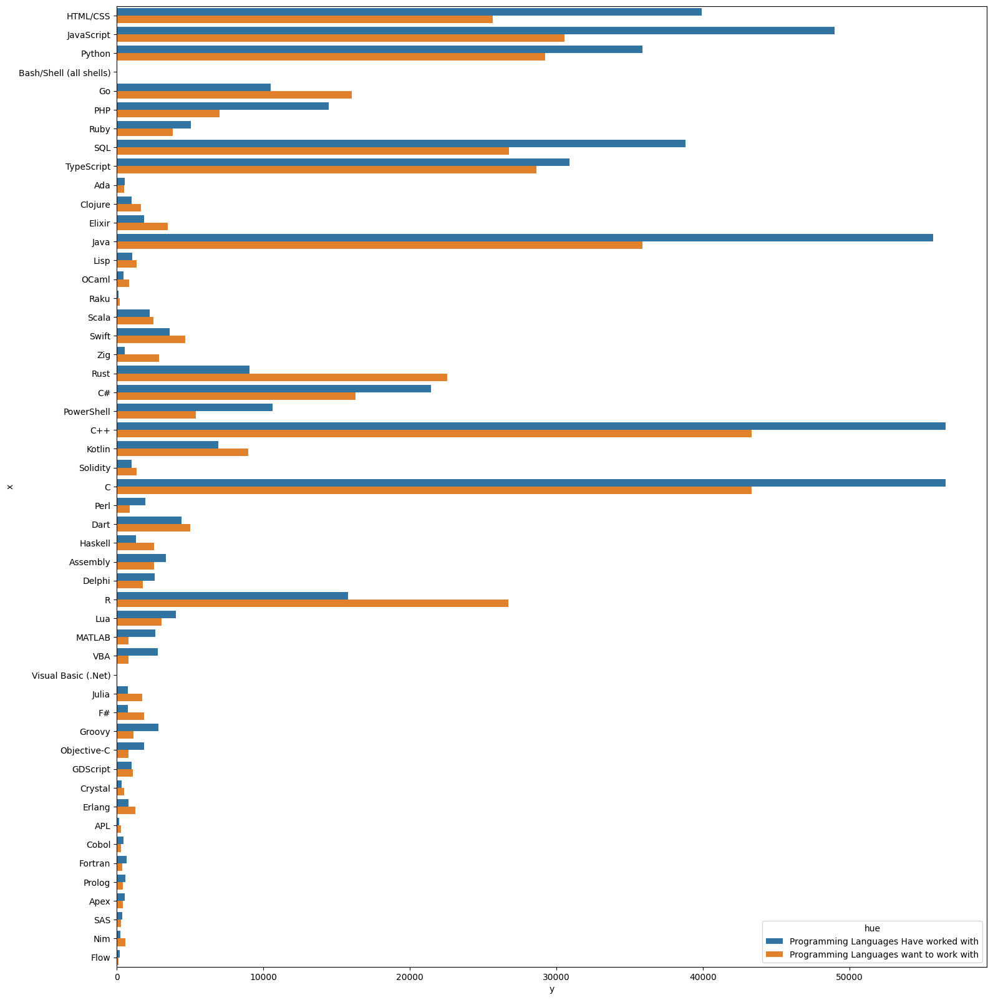
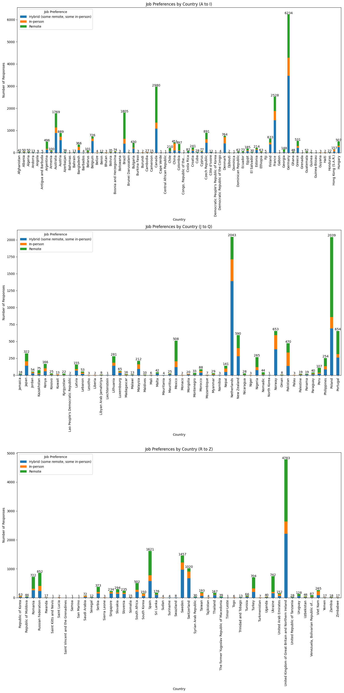
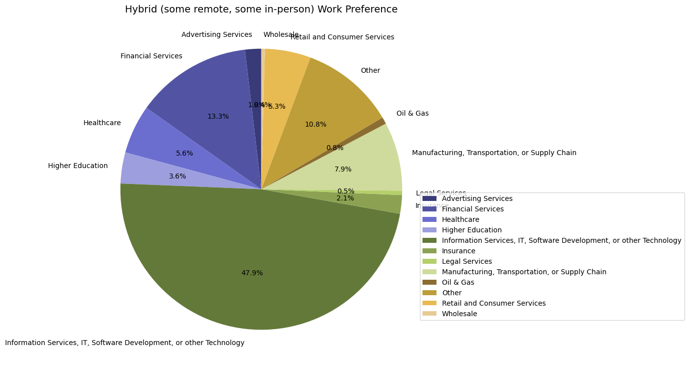
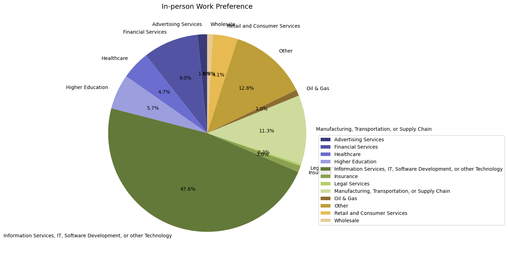
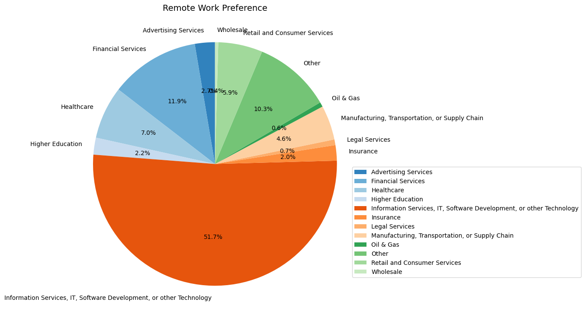
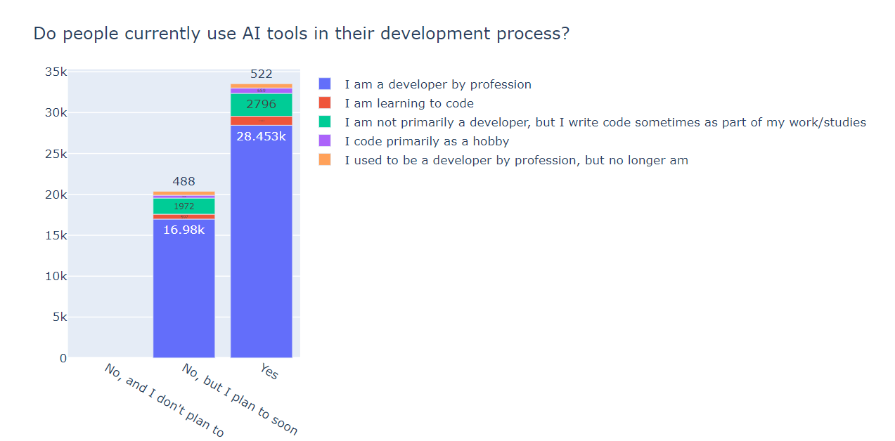
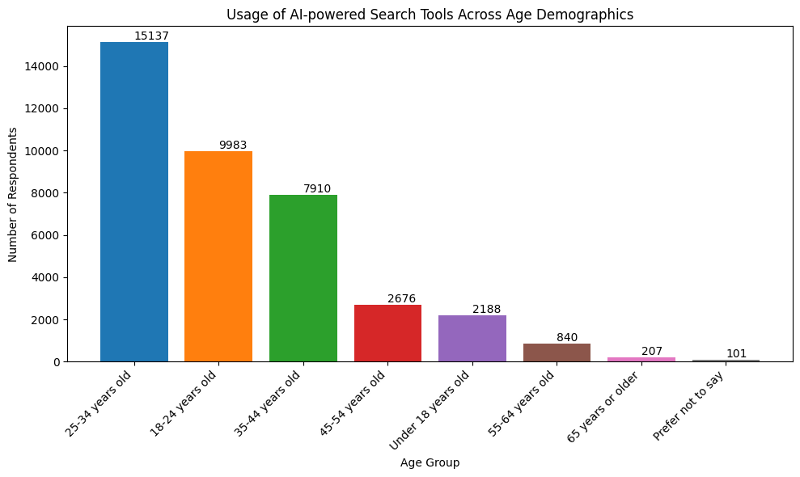

# Tech Industry Trends: Insights from Stack Overflow's 2023 Survey

## Introduction

In the ever-evolving tech industry, understanding the educational backgrounds, skill proficiencies, and work preferences of its workforce is vital. Our comprehensive survey analysis provides valuable insights into these critical aspects, shedding light on the qualifications and skills that drive success in programming and related fields.

### Key Findings

1. **Educational Backgrounds**: 
   - **Bachelor's Degree Dominance**: The majority of individuals in programming roles hold a Bachelor's degree.
   - **Diverse Paths**: A significant number of professionals possess Master's degrees, are self-taught, or come from non-traditional educational backgrounds, highlighting the industry's inclusivity.

2. **Skill Proficiencies**:
   - **Programming Languages**: Java, C, and C++ remain essential, with a notable rise in Python, especially in data science and AI. R continues to play a specialized role in statistical computing.
   - **Database Environments**: PostgreSQL, MySQL, and SQLite are preferred for their robustness and versatility in various applications.

3. **Compensation Trends**:
   - **High-Value Roles**: Specialized skills in developer experience, security, and data science command premium salaries in the USA.

4. **Work Preferences**:
   - **Remote vs. In-Person**: Developers show a near-even split in preference for remote and in-person work, indicating flexibility in work arrangements.

5. **AI Tool Usage**:
   - **Integration in Workflows**: There is significant adoption of AI tools in development processes, reflecting the integration of advanced technologies in modern workflows.

****
 

## Formal Education Levels of Programmers

The survey data on the highest level of formal education for individuals entering programming roles reveals significant trends about the educational backgrounds common in the tech industry.

- **Bachelor's Degree Dominance**: The majority of programmers (46.93%) hold a Bachelor's degree, indicating it as the standard entry-level qualification, providing a robust foundation in computer science and related fields.
  
- **Value of Advanced Degrees**: A significant portion (27.17%) have a Master's degree, reflecting the industry's value on advanced education and specialized knowledge for career advancement.
  
- **Non-Traditional Paths**: Notably, 11.77% of programmers entered the field with some college experience but no degree, highlighting the tech industry's openness to self-taught individuals and non-traditional educational backgrounds.
  
- **Less Common Qualifications**: Individuals with only secondary school education (4.53%) or an associate degree (3.32%) form a smaller part of the workforce, showing that while these qualifications are less common, they are still viable paths into the profession.
  
- **Diverse Educational Backgrounds**: Professional degrees (4.78%) and alternative education pathways (1.03%) represent a small but notable fraction, underscoring the diversity in educational backgrounds within the industry.

The data underscores the importance of higher education in programming roles, with a Bachelor's degree being the predominant level of education among programmers. However, the presence of individuals with various levels of formal education demonstrates the diverse pathways available to enter the programming profession, emphasizing the industry's inclusivity and flexibility.

 

## Programming Language Proficiency and Job Market Relevance

Our survey findings reveal the following trends in programming language proficiency and their relevance in the job market:

- **Java, C, and C++**: Approximately 70% of respondents are fully skilled in these languages, indicating their foundational and highly relevant status in the industry. 
  - **Java**: Renowned for its versatility and extensive use in enterprise applications, web development, and Android app development.
  - **C and C++**: Essential for system programming, game development, and performance-critical applications, highlighting their enduring importance.
- **Python**: Less than 50% of respondents reported proficiency in Python. Despite this, Python is critical due to its simplicity, readability, and powerful libraries, making it the preferred language for data science, machine learning, web development, and automation. The increasing demand for these skills is likely to drive Python's adoption.
- **R**: Around 20% of respondents are skilled in R, emphasizing its niche yet crucial role in data analysis and statistical computing. R's use in academia, research, and data-heavy industries underscores its importance despite lower overall adoption.

The data underscores the varying levels of demand and utility for different programming languages:
- **Dominance of Java, C, and C++**: These languages remain integral to many areas of development due to their broad applicability and foundational role in computer science.
- **Emerging Role of Python**: With its applicability in AI and data science, Python's lower current proficiency rate presents an opportunity for growth.
- **Specialized Value of R**: Despite its niche usage, R is vital for roles requiring extensive data manipulation and visualization.

  
 

Understanding these trends enables both current professionals and aspiring programmers to prioritize their learning to align with market needs, ensuring they stay competitive and capable of meeting industry demands.

 

## Global Disparities in Programming Job Entries

The survey data on job entries by country reveals significant disparities in the number of professionals entering the programming field across different nations. Here are the details and arguments about the top three countries in terms of entries into this job area:

### United States of America (11,852 entries)
The United States leads by a substantial margin, with 11,852 entries. This dominance can be attributed to several factors:
- **Robust Tech Industry**: Numerous global tech giants headquartered in the US offer extensive job opportunities.
- **Educational Excellence**: The US educational system produces a high number of graduates in computer science and related fields, supported by world-renowned universities and a strong emphasis on STEM education.
- **Entrepreneurial Culture**: Significant venture capital investment in tech startups creates a fertile environment for programming professionals.

### Germany (3,969 entries)
Germany ranks second with 3,969 entries. As Europe’s largest economy, Germany has a strong industrial base and a growing tech sector.
- **Engineering Prowess**: Known for its engineering excellence, Germany is advancing in fields like automotive technology, industrial automation, and renewable energy, all of which require substantial software development expertise.
- **Quality Education**: The country's emphasis on high-quality education and vocational training contributes to a steady influx of skilled programmers into the job market.

### United Kingdom of Great Britain and Northern Ireland (3,536 entries)
The United Kingdom follows closely with 3,536 entries.
- **Established Tech Industry**: Significant tech hubs in London, Manchester, and Edinburgh drive demand for programming talent.
- **Higher Education System**: Leading universities in the UK produce a steady stream of computer science graduates, underpinning its position as a major player in the tech industry.

The disparity in job entries across different countries highlights the varying levels of development and investment in the tech sector globally. Countries like the United States, Germany, and the United Kingdom have established themselves as leading tech hubs due to a combination of strong educational systems, significant economic investment in technology, and a vibrant industry ecosystem that supports innovation and job creation.

In contrast, countries with minimal entries, such as Tajikistan and the Lao People's Democratic Republic, often face economic and infrastructural challenges that hinder the development of a robust tech industry. Limited access to quality education in technology-related fields and fewer job opportunities in the tech sector contribute to the low number of programming professionals in these regions.

These findings underscore the importance of strategic investments in education, infrastructure, and industry support to foster a thriving tech ecosystem capable of attracting and nurturing programming talent.

 

## Top Utilized and Preferences in Database Environments

The survey data reveals interesting trends in database environments where developers have done extensive work over the past year and their preferences for the upcoming year.

- **PostgreSQL (15.71%)**: Leads the pack, highlighting its popularity due to its robustness, scalability, and open-source nature.
- **MySQL (14.17%)**: Follows closely, reflecting its widespread use in web applications and as a reliable relational database management system.
- **SQLite (10.65%)**: Notable for its lightweight and self-contained nature, making it popular for mobile and embedded applications.
- **MongoDB (8.8%) and Microsoft SQL Server (8.78%)**: Show significant usage, emphasizing their roles in handling large datasets and enterprise-level applications respectively.
- **Redis (7.04%) and MariaDB (6.07%)**: Appreciated for their performance and compatibility.
- **Elasticsearch (4.62%), DynamoDB (3.06%), and Oracle (3.38%)**: Serve specialized needs in search, NoSQL databases, and large-scale enterprise solutions.

Looking ahead, the preferences for database environments indicate a continued reliance on established technologies with strong community support and versatility.

- **PostgreSQL and MySQL's high ratios**: Suggest developers value their ongoing evolution and reliability.
- **SQLite's considerable ratio**: Underlines the growing trend towards mobile and lightweight applications.
- **Interest in MongoDB and Microsoft SQL Server**: Indicates a sustained need for flexible, scalable, and robust database solutions.
- **Redis's popularity**: Points to the importance of in-memory data structure stores for caching and real-time analytics.
- **Specialized roles of Elasticsearch, DynamoDB, and Oracle**: Continue to secure their places in the ecosystem, catering to niche but critical areas of application development.

These insights highlight the dynamic and diverse nature of database environment preferences among developers. 

 

## Programming Languages Worked With Compared to the Programming Languages Developers Want to Work With

The survey reveals that C, Java, JavaScript, and Python are the most utilized programming languages, with usage counts of 54,823, 35,891, 30,538, and 29,245 respectively. In contrast, languages such as Visual Basic (1,097), APL (277), and Flow (138) are among the least used.

Several factors may contribute to these findings:
- **C**: Its prominence can be attributed to its foundational role in system programming and its efficiency in resource-constrained environments.
- **Java**: Widespread use in enterprise applications, coupled with its portability across platforms, ensures its continued popularity.
- **JavaScript**: Essential role in web development makes it indispensable for front-end developers.
- **Python**: Simplicity and versatility, particularly in data science, artificial intelligence, and academic research, bolster its usage.

On the other hand, less popular languages like Visual Basic, APL, and Flow are either considered outdated, have niche applications, or lack the extensive community and industry support that bolster the popularity of more commonly used languages. This disparity in usage highlights the influence of industry demands, community support, and the evolving nature of technology on programming language adoption.

### Most Languages Worked With
| Rank | Programming Language | Usage Count |
|------|----------------------|-------------|
| 1    | C                    | 66,235      |
| 2    | Java                 | 55,724      |
| 3    | JavaScript           | 48,991      |
| 4    | HTML/CSS             | 39,916      |
| 5    | SQL                  | 38,804      |
| 6    | Python               | 35,888      |
| 7    | C++                  | 15,304      |
| 8    | Visual Basic         | 3,157       |
| 9    | Flow                 | 194         |
| 10   | APL                  | 151         |

The survey data indicates that the most desired programming languages to work with are C, Java, JavaScript, and Python, with respective interest counts of 54,823, 35,891, 30,538, and 29,245. Conversely, languages such as Flow (138), APL (277), and Visual Basic (1,097) are the least desired. This trend mirrors the actual usage patterns and can be attributed to several factors:
- **C**: Demand remains high due to its critical role in system-level programming and performance-critical applications.
- **Java**: Robust ecosystem and strong presence in enterprise environments make it a preferred choice among developers.
- **JavaScript**: Highly sought after due to its indispensability in web development and the ongoing expansion of web technologies.
- **Python**: Driven by its readability, ease of use, and powerful capabilities in emerging fields like data science, machine learning, and automation.

  

On the other hand, Flow, APL, and Visual Basic are less desired due to their limited application scope, lack of modern use cases, and relatively smaller communities. Visual Basic, once popular for Windows application development, has seen a decline with the rise of more modern languages. APL, known for its niche in array processing, does not attract widespread interest due to its specialized nature. Flow, being a newer and less established language, has not yet garnered significant attention or adoption. These findings reflect the alignment between industry demands, the evolution of technology, and the preferences of the developer community in selecting programming languages for current and future projects.

### Most Languages Wanted to Work With
| Rank | Programming Language | Interest Count |
|------|----------------------|----------------|
| 1    | C                    | 54,823         |
| 2    | Java                 | 35,891         |
| 3    | JavaScript           | 30,538         |
| 4    | Python               | 29,245         |
| 5    | SQL                  | 26,772         |
| 6    | HTML/CSS             | 25,663         |
| 7    | C++                  | 10,668         |
| 8    | Visual Basic         | 1,097          |
| 9    | APL                  | 277            |
| 10   | Flow                 | 138            |

 

## Web Frameworks Worked With Compared to the Web Frameworks Developers Want to Work With

The survey data presents a clear picture of the current and desired usage of various web frameworks. **React** emerges as the most used web framework with 26,150 users and also tops the list of frameworks developers most want to work with, with 21,653 expressing interest. This can be attributed to React's robust ecosystem, extensive community support, and flexibility in building dynamic user interfaces.

**ASP.NET** and its modern variant **ASP.NET Core** also feature prominently. ASP.NET has 13,417 users, while ASP.NET Core is used by 11,341 developers. However, when it comes to future interest, ASP.NET garners 10,397 responses, and ASP.NET Core has 9,561, indicating a strong, sustained interest in these frameworks due to their reliability, performance, and integration with the Microsoft ecosystem.

**Next.js**, a framework built on top of React, is used by 10,483 developers and ranks second in desirability with 12,273 developers wanting to work with it. This reflects the growing trend towards server-side rendering and static site generation capabilities that Next.js offers, making it a popular choice for modern web development.

On the other end of the spectrum, frameworks like **Elm**, **Lit**, and **Qwik** are the least used and desired. Elm, with 516 current users and 924 developers interested in working with it, appeals to a niche audience due to its focus on functional programming and guaranteed absence of runtime exceptions. Lit, with 446 current users and 570 wanting to use it, and Qwik, with 323 users and 1,852 expressing interest, are emerging frameworks. While they are not widely adopted yet, the interest in Qwik suggests curiosity about its performance optimizations and innovative approach to modern web development.

The comparison between current usage and future interest highlights a few key trends: established frameworks like React and Next.js continue to dominate due to their versatility and strong community support. ASP.NET frameworks maintain a strong presence, driven by their enterprise-grade capabilities. Meanwhile, emerging frameworks are generating interest, pointing to a future where performance and innovation could redefine the web development landscape.

### Web Frameworks Wanted to Work With
| Rank | Web Framework | Interest Count |
|------|---------------|----------------|
| 1    | React         | 21,653         |
| 2    | Next.js       | 12,273         |
| 3    | ASP.NET       | 10,397         |
| 4    | ASP.NET Core  | 9,561          |
| 5    | Qwik          | 1,852          |
| 6    | Elm           | 924            |
| 7    | Lit           | 570            |

### Web Frameworks Have Worked With
| Rank | Web Framework  | User Count |
|------|----------------|------------|
| 1    | React          | 26,150     |
| 2    | ASP.NET        | 13,417     |
| 3    | ASP.NET Core   | 11,341     |
| 4    | Next.js        | 10,483     |
| 5    | Elm            | 516        |
| 6    | Lit            | 446        |
| 7    | Qwik           | 323        |

 

## USA Top Ten Developer Types and Their Salaries with One Year of Experience

The survey data on annual total compensation across various tech roles in the USA highlights why the tech industry is considered one of the highest-paying industries. The data reveals that the highest compensation (with 1 year of experience) is being received by a **back-end developer**, with an annual compensation of $400,000. This is likely due to the critical role they play in building and maintaining the server-side logic of applications, which is crucial for ensuring the performance and reliability of services.

**Data scientist/Machine learning specialists** stand second on the list, with a total compensation of $300,000. This high compensation reflects the increasing demand for expertise in AI and data analytics, as these professionals drive innovation and provide valuable insights across industries.

**Hardware engineers** and **security professionals** each receive $250,000 annually. Hardware engineers are essential for developing and improving the physical components of technology, while security professionals are critical for protecting systems and data, a role that has gained heightened importance due to the rise in cyber threats.

Other roles such as **Developer Experience** ($230,000), **Developer for desktop or enterprise applications** ($220,000), and **full-stack developers** ($206,000) are also amongst the top salaried roles. The Developer Experience role, which focuses on improving the workflow and tools for developers, highlights the value placed on productivity and efficiency in software development processes.

This data underscores the varying levels of compensation tied to different specialties within the tech industry, reflecting market demand, the complexity of the roles, and the critical nature of the skills required. The high compensation for back-end developers, data scientists, and security professionals highlights their pivotal role in the current technological landscape.

### Top Ten Highest Salaries (USD)

| Rank | Working Area                                  | Total Compensation (USD) |
|------|-----------------------------------------------|--------------------------|
| 1    | Developer, back-end                          | 400,000                  |
| 2    | Data scientist or machine learning specialist| 300,000                  |
| 3    | Hardware Engineer                             | 250,000                  |
| 4    | Security professional                         | 250,000                  |
| 5    | Other working areas                           | 238,000                  |
| 6    | Developer Experience                          | 230,000                  |
| 7    | Security professional                         | 225,000                  |
| 8    | Developer, desktop or enterprise applications| 220,000                  |
| 9    | Developer, back-end                          | 220,000                  |
| 10   | Developer, full-stack                        | 206,000                  |

Further exploratory analysis of the data reveals the tech roles that, on average, earn the highest salaries. The role of **Developer Experience** tops the list with an average salary of $230,000, reflecting the high value placed on optimizing developer workflows and tools, which are crucial for enhancing productivity and efficiency in software development.

**Security professionals** follow, with an average salary of $188,666.67. This underscores the significant emphasis on cybersecurity, as protecting data and systems from breaches has become paramount in an increasingly digital world.

Developers specializing in **game or graphics development** earn an average of $155,000 annually. This high salary highlights the niche skills required in the gaming and graphics industry, which demand creativity and technical expertise.

**Hardware engineers** and **cloud infrastructure engineers** have average salaries of $137,800 and $137,645, respectively. Hardware engineers are vital for designing and developing physical computing components, while cloud infrastructure engineers ensure the reliability and scalability of cloud services, both essential roles in the tech ecosystem.

**Data scientists or machine learning specialists** earn an average of $134,250, reflecting the demand for expertise in data analytics and AI, which drive innovation and strategic decision-making in various industries.

**Back-end developers** have an average salary of $116,746.15, indicating the importance of their role in maintaining the server-side logic of applications, which is crucial for the performance and functionality of services.

**Research & Development roles** and **data engineers** earn average salaries of $114,666.67 and $113,333.33, respectively. These roles are critical for advancing technological capabilities and handling large datasets, driving progress and efficiency.

The 'Other' category, with an average salary of $109,048.18, likely includes various specialized roles that do not fit into the standard categories but still require significant expertise and contribute to the tech industry.

This data illustrates the diverse compensation landscape within the tech industry, emphasizing the value of specialized skills and the critical nature of various roles. The high salaries in roles like Developer Experience, security, and data science reflect the industry's prioritization of productivity, security, and data-driven decision-making.

### Top Ten Average Salaries (USD)

| Rank | Developer Type                              | Average Salary |
|------|---------------------------------------------|-----------------|
| 1    | Developer Experience                        | 230,000         |
| 2    | Security professional                       | 188,666.67     |
| 3    | Developer, game or graphics                 | 155,000         |
| 4    | Hardware Engineer                           | 137,800         |
| 5    | Cloud infrastructure engineer               | 137,645         |
| 6    | Data scientist or machine learning specialist | 134,250         |
| 7    | Developer, back-end                         | 116,746.15      |
| 8    | Research & Development role                 | 114,666.67      |
| 9    | Engineer, data                              | 113,333.33      |
| 10   | Other (please specify)                     | 109,048.18      |

 

## Work Preference Analysis of Developers

The global shift in work arrangements, accelerated by the COVID-19 pandemic, has led to diverse work preferences among professionals. This analysis focuses on understanding these preferences within the developer community. By examining data on work arrangements—remote, hybrid, and in-person—this project provides valuable insights into the current trends and preferences among developers. Such insights are crucial for tech companies, aspiring developers, and industry analysts.

This analysis is structured around four key visualizations:

- **General Work Preferences of Developers**
- **Work Preferences by Age**
- **Work Preferences by Country**
- **Work Preferences by Industry**
   
1. **General Work Preferences of Developers:** The first visualization provides a comprehensive view of developers' work preferences. The pie chart clearly shows that:
- A significant majority of developers prefer remote work.
- Hybrid work is the second most preferred option.
- In-person work is the least favored among the three categories.

2. **Work Preferences by Age**: The second set of visualizations dives deeper into how work preferences differ across various age groups. The bar charts reveal notable trends:
- Younger developers (18-24 years old) have a slightly higher preference for in-person work compared to other age groups.
- Across all age groups, remote and hybrid work arrangements are overwhelmingly preferred.
- Older developers show a particularly strong preference for remote work, likely valuing the reduced need for commuting and increased work-life balance.

  
  

3. **Work Preferences by Country**: The third visualization analyzes work preferences across different countries, categorized into three groups based on the initial letter of the country's name:
- A to I
- J to Q
- R to Z

Each section's bar chart shows the distribution of job preferences within the group of countries. This analysis reveals significant variations in work preferences across different regions, providing valuable insights for multinational companies.
 

4. **Work Preferences by Industry**: The fourth visualization delves into the variation in work preferences among different industries. The pie charts depict the proportion of work preferences for each industry category. Key findings include:
- The Information Services, IT, Software Development, or other Technology sector exhibits the highest overall flexibility, leading in both hybrid and remote work preferences.
- Traditional or physically demanding industries like Manufacturing and Legal Services show stronger preferences for in-person work.
- Financial Services exhibit a balanced approach, with notable shares in all three categories, indicating adaptability to different work environments.

The data reveals a strong preference for remote and hybrid work among developers, which tech companies can leverage to enhance job satisfaction and productivity. Understanding age-related variations in preferences also helps create inclusive work environments. These insights are invaluable for aspiring developers, tech companies, and industry analysts, enabling them to foster a flexible, inclusive, and productive tech ecosystem.

 

## AI and Tech Industry

The advancement of AI and its tools has significantly streamlined workflows, benefiting users by making their tasks easier. However, it has also raised concerns about job security and created uncertainty about the appropriateness of using AI tools in professional settings. This data provides insights into these concerns by showcasing the general consensus on these issues, helping to answer some of the pressing questions and clear up confusion.

### AI Usage in Development Process

The majority of professional developers reported using AI tools in their development process (28.453k), while others expressed intentions to do so (16.98k), indicating a positive trend towards AI adoption. However, a significant number of developers stated they do not use AI tools and have no plans to do so (19.538k). This insight suggests varying attitudes towards AI among developers, with some embracing its benefits while others remain skeptical. The visualization also highlights similar trends among other developer groups, providing a comprehensive overview of AI adoption in the tech community.

Interestingly, the largest proportion of individuals currently utilizing AI in development falls within the 25-34 age bracket, indicating a trend towards increased adoption among younger demographics. This suggests a shifting landscape where AI technology is progressively integrated across all age demographics, signifying its growing significance in the future.

Furthermore, the pie chart illustrates opinions on whether using AI in the development process is favorable or not. A large majority, 48.3%, believe it is favorable, while 27.9% find it very favorable. Conversely, some developers are indifferent or express reservations about its impact. This insight sheds light on the overall sentiment towards AI adoption among developers.

Additionally, a grouped box plot visually represents the distribution of trust levels on accurancy of AI within each group of countries, divided into three sections based on the alphabetical range of their names.

1. **Median**: The line inside the box represents the median trust level, indicating the central tendency of the data.
2. **Interquartile Range (IQR)**: The box itself spans the IQR, containing the middle 50% of the data.
3. **Whiskers**: Lines extending from the box represent the range of the data, excluding outliers. They typically extend 1.5 times the IQR from the first and third quartiles.
4. **Outliers**: Individual data points lying beyond the whiskers are considered outliers and are shown separately.

Acording to the image, here's a customized interpretation of the trust levels in AI accuracy by country, categorized into four groups:

**Group 1: High Trust**: Countries in this group have a significant portion of responses in the 'Highly trust' category, with long bars extending towards this end. These countries exhibit a strong confidence in the accuracy of AI, suggesting positive public opinion and possibly good experiences with AI technologies.
- *Finland*
- *Singapore*

**Group 2: Moderate Trust**: This group includes countries with a majority of responses in the 'Somewhat trust' category. The trust levels are positive but not as strong as in Group 1, indicating a cautiously optimistic view of AI among the public.
- *Netherlands*
- *Nigeria*
- *Portugal*
- *United Arab Emirates*
- *Philippines*
- *Indonesia*
- *India*
- *South Korea*
- *Kenya*
- *Brazil*

**Group 3: Neutral / Mixed Feelings**: Countries here have their longest bars around the 'Neutral/Do not know' point. This suggests a lack of strong opinions towards AI accuracy, which could be due to a lack of exposure or understanding of AI technologies.
- *Germany*
- *United States*
- *United Kingdom*
- *Spain*
- *South Africa*
- *Australia*
- *Canada*
- *France*
- *Italy*
- *Poland*
- *Russia*
- *Turkey*
- *Japan*
- *Mexico*
- *Argentina*

**Group 4: Low Trust**: The final group consists of countries with the majority of responses in the 'Somewhat distrust' and 'Highly distrust' categories. These countries show skepticism towards AI accuracy, which could stem from negative experiences, lack of information, or cultural attitudes towards technology.
- *Iran*
- *Egypt*
- *Iraq*
- *Pakistan*
- *Bangladesh*
- *Sudan*
- *Venezuela*
- *Greece*
- *Colombia*
- *Afghanistan*
- *Syria*
- *North Korea*
- *Libya*
- *Haiti*
- *Central African Republic*

The grouped box plot aids in exploring variations in trust levels among different regions, guiding policymakers, researchers, and industry professionals in understanding the factors influencing trust in AI tools and devising strategies to address concerns or capitalize on positive perceptions.

 

### Conclusion

This analysis provides a detailed understanding of educational and skill trends within the tech industry. It equips current and aspiring professionals with essential information to navigate and excel in this dynamic field. By recognizing the diverse educational backgrounds, key skill sets, and evolving work preferences, stakeholders can foster a more inclusive, flexible, and productive tech environment.
