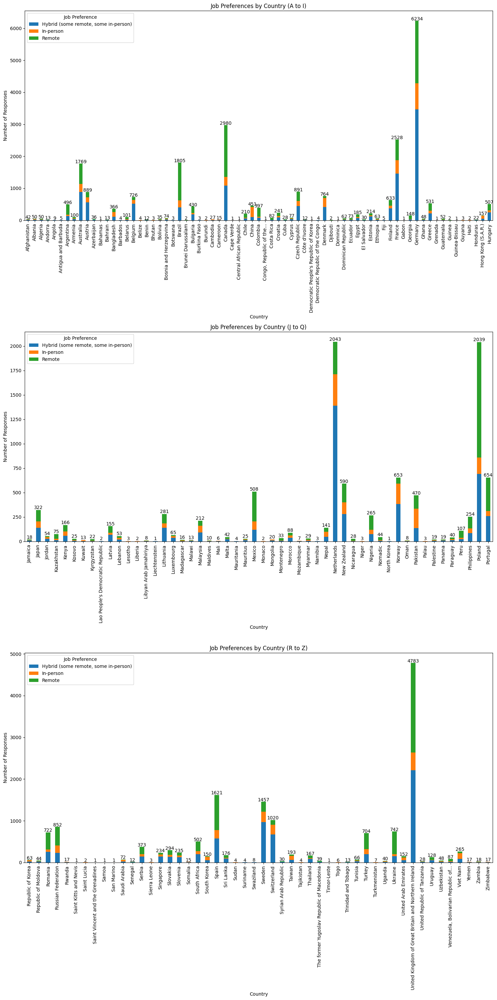
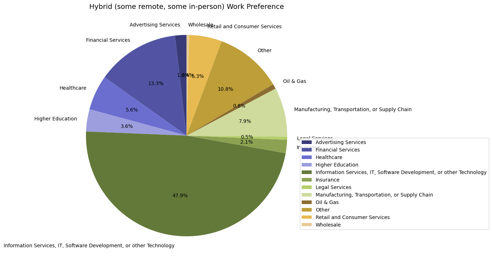
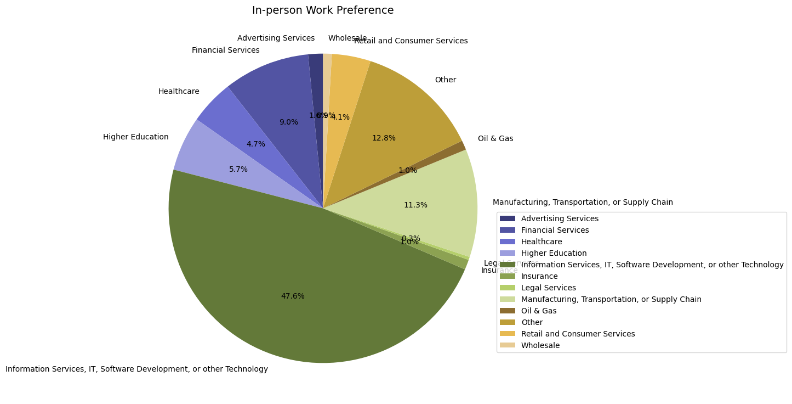
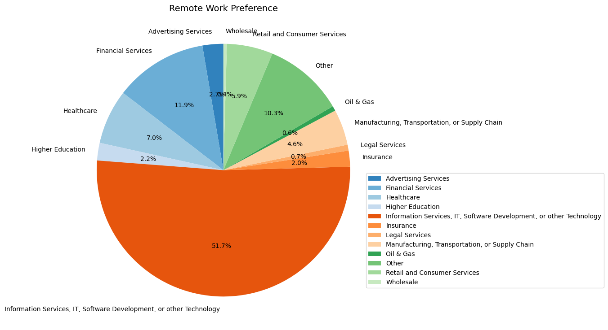
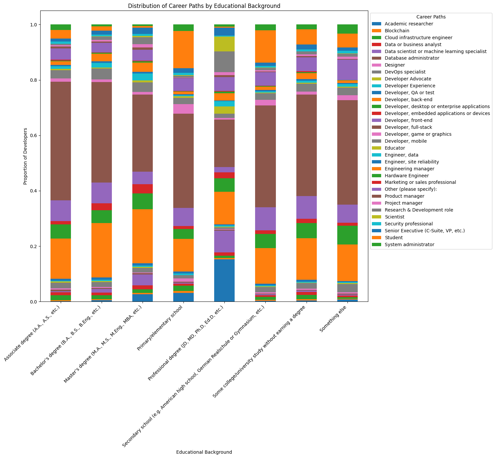
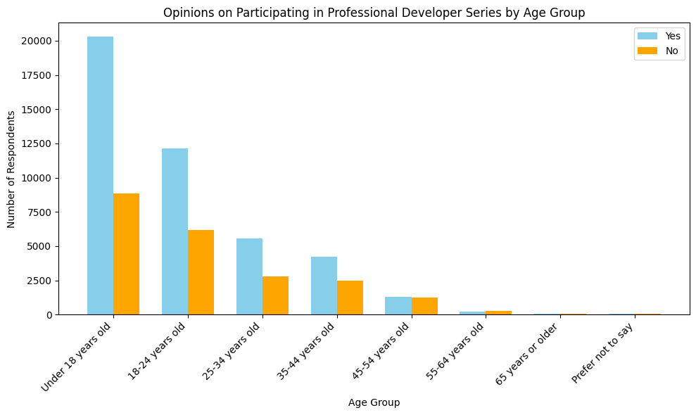

## Description of the data analysis performed by Nagin.

-	### Work Preference of Developers

The data on remote work preferences among developers reveals that the majority favor remote work, with 42.2% (37,615 developers) preferring this mode. In-person work is almost equally popular, preferred by 41.4% (36,933 developers). Hybrid work, which combines both remote and in-person elements, is the least favored, chosen by 16.4% (14,636 developers). This indicates a nearly even split between developers who prefer exclusively remote or in-person work, with a smaller segment opting for a mixed approach.

-	### Remote Work Preferences by Age

The plot visualizes remote work preferences among developers based on age, using a series of bar charts. Each chart shows the percentage of developers in different age groups preferring remote, in-person, and hybrid work. The x-axis represents age groups, and the y-axis shows the percentage. The stacked bars indicate the distribution of preferences, with a legend for clarity. Annotations display the total number of developers in each age group, offering insights into how remote work preferences vary by age.

The data on remote work preference variation by age reveals distinct trends in how different age groups prefer to work. Younger individuals, particularly those under 18, show a strong preference for remote work, with 50% favoring this mode, while only 22% prefer in-person and 28% prefer hybrid. This preference for remote work remains relatively high among the 18-24 age group, though hybrid work becomes more popular at 42%, and in-person work is preferred by 26%.

As age increases, the preference for in-person work grows significantly. The 25-34 and 35-44 age groups both show a high preference for in-person work at 60%, with remote work being the least preferred option (8% and 12% respectively). For those aged 45-54, while in-person work is still popular at 50%, the preference for remote work rises to 26%, indicating a more balanced view between in-person and remote work compared to the younger groups.

For individuals aged 55-64, remote work becomes more favorable again, with 48% preferring it, while 35% prefer in-person and 17% prefer hybrid work. The trend peaks in the 65+ age group, where a substantial 82% prefer remote work, and only 13% and 5% prefer in-person and hybrid work, respectively. Among respondents who prefer not to disclose their age, there is an overwhelming preference for remote work at 96%, with negligible interest in hybrid or in-person options.

These findings suggest that younger and older age groups lean more towards remote work, while the middle-aged groups show a stronger inclination towards in-person work. This variation could be influenced by different factors such as career stage, family responsibilities, health concerns, and lifestyle preferences.

-	### Analyze Preference Variation based on different factors: Country [Must be revised] 

This chart does not provide any analysis; it only presents raw data or the information written in the description cannot be analyzed using this chart. Therefore, there is nothing to describe.

-	### work preferences among developers across different industries

The survey data comparing work preferences among developers across various industries highlights significant variations in the adoption of remote, in-person, and hybrid work setups.

Hybrid Work Preference: In the hybrid work category, the Information Services, IT, Software Development, or other Technology sector dominates, with 47.9% of developers in this industry preferring a mix of remote and in-person work. Financial Services follow at 13.3%, and Manufacturing, Transportation, or Supply Chain accounts for 7.9%. Other notable industries include Healthcare (5.6%) and Retail and Consumer Services (5.3%). This indicates a strong inclination towards flexible work arrangements in the tech sector, while industries like Legal Services (0.5%) and Oil & Gas (0.8%) show minimal preference for hybrid work.

In-person Work Preference: For in-person work, the Information Services, IT, Software Development, or other Technology sector again leads with 47.6%, nearly mirroring its hybrid work preference. Manufacturing, Transportation, or Supply Chain shows a higher preference for in-person work at 11.3%, suggesting that roles in this sector might be less conducive to remote work. Financial Services and Higher Education also show significant in-person preferences at 9.0% and 5.7%, respectively. The Legal Services industry has the lowest in-person work preference at 0.3%, indicating a potential shift towards remote work even in traditionally office-centric roles.

Remote Work Preference: Remote work preference is highest in the Information Services, IT, Software Development, or other Technology sector, with 51.7% of developers favoring this mode. Financial Services follow at 11.9%, reflecting the sector's increasing adaptability to remote operations. Healthcare has a notable preference at 7.0%, possibly driven by the recent shift towards telehealth. Other significant industries include Retail and Consumer Services (5.9%) and Manufacturing, Transportation, or Supply Chain (4.6%). Legal Services, with 0.7%, and Wholesale, at 0.4%, show the least preference for remote work, indicating that some industries still rely heavily on physical presence.

When comparing these preferences, it is evident that the Information Services, IT, Software Development, or other Technology sector shows the highest overall flexibility, leading in both hybrid (47.9%) and remote (51.7%) work preferences while maintaining a significant share in in-person work (47.6%). This underscores the sector's adaptability and the nature of tech work, which is highly compatible with remote environments. Conversely, industries like Manufacturing, Transportation, or Supply Chain have a stronger inclination towards in-person work (11.3%), reflecting the necessity for physical presence in many of their roles. Financial Services exhibit a balanced approach, with notable shares in all three categories, indicating a diverse range of roles and adaptability to different work environments. Legal Services, Wholesale, and Oil & Gas consistently show low preferences for hybrid and remote work, suggesting these industries may face more significant challenges in shifting away from traditional in-person work setups.

In summary, these findings highlight the varying degrees of flexibility and adaptability across industries regarding work preferences. The technology sector leads in embracing hybrid and remote work, while more traditional or physically demanding industries like Manufacturing and Legal Services show stronger preferences for in-person work.

-   ### Distribution of Career Path by Educational Background

To accurately describe this detailed chart, I need specific numerical values for each Career Path. Without these values, I cannot compare information across different levels of education and training or track changes for each Career Path at each educational level. Although the diagram visually conveys a lot of information, specific numerical data is essential for a thorough description.

-	### Distribution of Education Background Among Developers
[This Partt is analyzed by Mustafa.]

-   ### Distribution of Influence Levels Across Organization Sizes

The provided code generates a grouped box plot visualizing the distribution of trust levels in the accuracy of AI tools across different countries, categorized alphabetically.

The box plot visually represents the distribution of trust levels within each group of countries, divided into three sections based on the alphabetical range of their names. Within each section, the box plot illustrates five summary statistics: Median: The line inside the box represents the median trust level, indicating the central tendency of the data. Interquartile Range (IQR): The box itself spans the IQR, which contains the middle 50% of the data. Whiskers: Lines extending from the box represent the range of the data, excluding outliers. They typically extend 1.5 times the IQR from the first and third quartiles. Outliers: Individual data points lying beyond the whiskers are considered outliers and are shown separately.

we can compare the box plots across the three sections to identify differences in trust levels among countries grouped alphabetically. Variations in the height, width, and position of the boxes and whiskers provide insights into the dispersion and central tendency of trust levels within each group of countries. This visualization facilitates easy comparison of trust levels in AI tool accuracy across different country groups.

-   ### Trust in Accuracy of AI Tools by Country

This chart does not provide any analysis; it only presents raw data. Therefore, I can not describe something meaningfull from that.

-	### Usage of AI-powered Search Tools Across Age Demographics

The visualization depicts the distribution of respondents' ages who utilize AI-powered search tools. The x-axis categorizes different age groups, from "Under 18 years old" to "Prefer not to say," while the y-axis quantifies the number of respondents in each category. Each bar in the chart represents a specific age group, with its height corresponding to the number of respondents. Additionally, the exact count of respondents is displayed above each bar for clarity. 

The data reveals significant variations in usage across age groups. The 25-34 age group shows the highest engagement with 15,137 respondents, followed by the 18-22 group with 9,983 respondents. The 35-44 age group has a moderate usage level with 7,910 respondents. Younger respondents under 18 years old account for 2,188 users, indicating substantial interest even among the youngest group. Usage declines notably in older age groups, with 2,675 respondents aged 45-54, 840 aged 55-64, and just 207 respondents aged 65 and over. Those who prefer not to disclose their age constitute 101 respondents. This distribution highlights the strong adoption of AI-powered search tools among younger to middle-aged individuals, offering valuable insights into the target demographics for such technologies.

-	### Opinions on Participating in Professional Developer Series by Age Group

This visualization will show the opinions of respondents on participating in a professional developer series categorized by age groups. Each age group is represented on the x-axis, while the number of respondents is shown on the y-axis. The respondents' opinions are divided into two categories: "Yes" and "No," represented by bars of different colors. The height of each bar corresponds to the number of respondents within that age group who answered either "Yes" or "No" to participating in the professional developer series.

